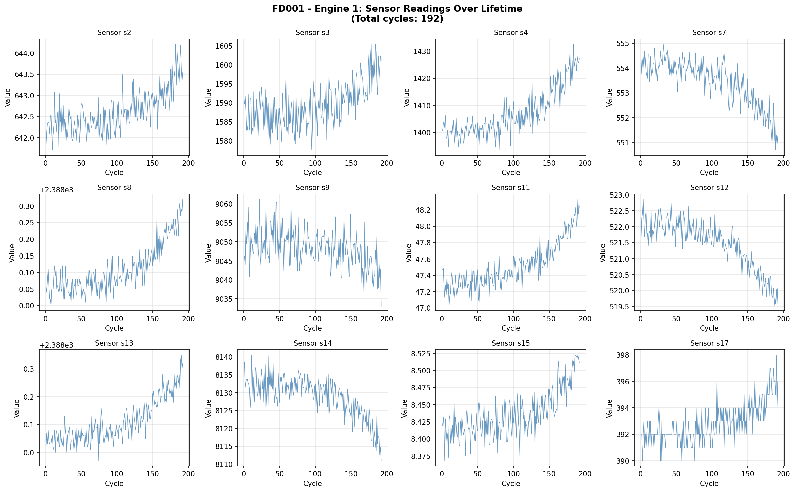
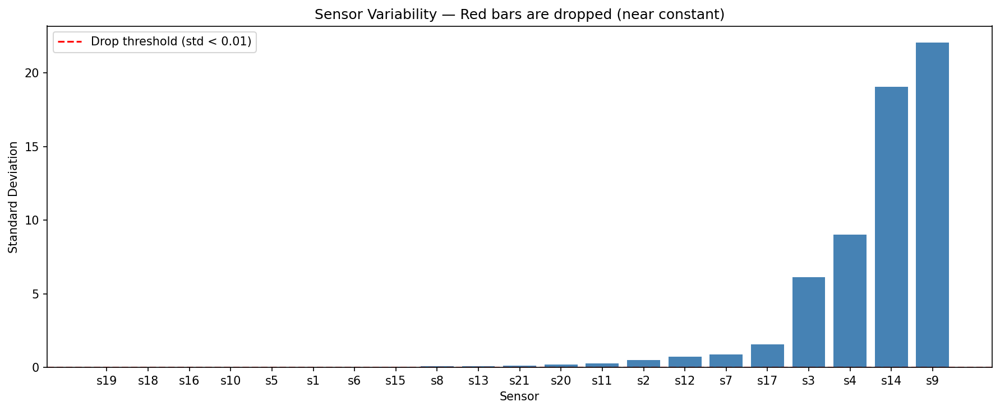
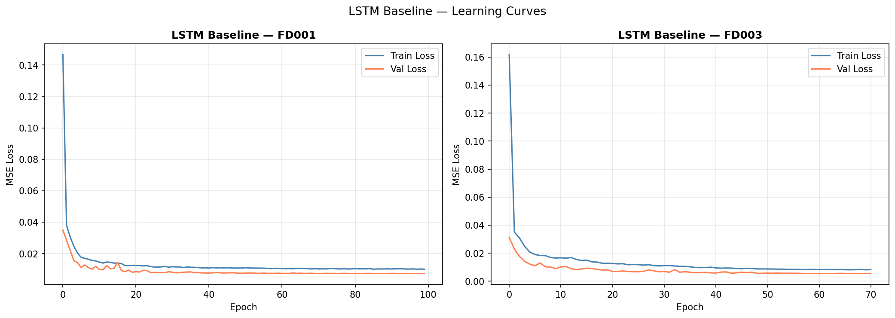

# Predictive Maintenance for Turbofan Engines

Deep learning project for Remaining Useful Life (RUL) prediction on NASA C-MAPSS turbofan engine degradation data.

This repository contains my final Jupyter notebook, experiment outputs, and model comparison results for turbofan engine predictive maintenance. The goal is to estimate how many cycles remain before engine failure using multivariate time-series sensor data.

## Dataset

- Source: [NASA C-MAPSS Turbofan Engine RUL Dataset on Kaggle](http://kaggle.com/datasets/fareselgohary003/nasa-cmapss-turbofan-engine-rul-dataset)
- Subsets used: `FD001`, `FD002`, `FD003`, `FD004`
- Data type: multivariate time-series sensor readings from simulated aircraft engines

## Project Highlights

- Built an end-to-end RUL prediction workflow in Jupyter Notebook
- Used all four C-MAPSS subsets for training and evaluation
- Compared multiple deep learning architectures for RUL estimation
- Evaluated models using `RMSE` and NASA scoring metric
- Exported trained model artifacts and summary metrics for reuse

## Models Compared

- Stacked LSTM
- 1D-FCLCNN
- 1D-FCLCNN+LSTM (paper baseline)
- SA-FCLCNN-TF (ours)
- SA-FCLCNN-TF-PINN (ours)

## Final Results

| Model | FD001 RMSE | FD002 RMSE | FD003 RMSE | FD004 RMSE |
| --- | ---: | ---: | ---: | ---: |
| Stacked LSTM | 16.185 | 24.985 | 20.080 | 29.507 |
| 1D-FCLCNN | 19.998 | 21.707 | 20.898 | 26.749 |
| 1D-FCLCNN+LSTM (Paper) | 18.003 | 19.841 | 16.030 | 25.792 |
| SA-FCLCNN-TF (Ours) | 12.558 | 19.596 | 13.791 | 24.886 |
| SA-FCLCNN-TF-PINN (Ours) | 13.510 | 21.165 | 12.506 | 24.657 |

Best results among my models:

- `FD001`: SA-FCLCNN-TF with RMSE `12.558`
- `FD002`: SA-FCLCNN-TF with RMSE `19.596`
- `FD003`: SA-FCLCNN-TF-PINN with RMSE `12.506`
- `FD004`: SA-FCLCNN-TF-PINN with RMSE `24.657`

Detailed metrics are available in [metrics_summary.json](metrics_summary.json).

## Repository Structure

```text
turbofan-rul-prediction/
├── RUL_FINAL_PROJECT.ipynb
├── README.md
├── requirements.txt
├── .gitignore
├── metrics_summary.json
└── assets/
    ├── sensor_degradation.png
    ├── sensor_selection.png
    └── lstm_learning_curves.png
```

## Setup

1. Create a Python virtual environment.
2. Install dependencies:

```bash
pip install -r requirements.txt
```

3. Download the dataset from Kaggle.
4. Keep the expected local folder structure used by the notebook.
5. Open `RUL_FINAL_PROJECT.ipynb` in Jupyter Notebook or JupyterLab and run cells in order.

## Notes

- The raw dataset files are not included in this repository.
- Large generated outputs, checkpoints, and trained model binaries should generally stay out of GitHub unless specifically needed.
- This repo is focused on the ML/modeling part of the project.

## Visuals

### Sensor Degradation



### Sensor Selection



### Learning Curves



## Author

Jyotsna
